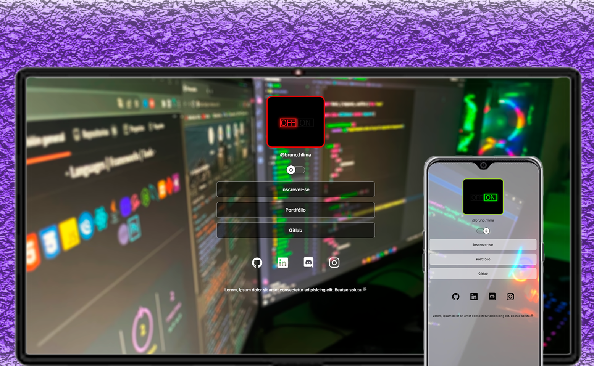

<h1 align="center">Hey 👋 What's up?</h1>

###

My name is Bruno, This is an initial portfolio project.

###

<h2 align="left"></h2>

###

###

<h2 align="center">In this project I code with</h2>

###

  
  
  
  
  

###

  

###